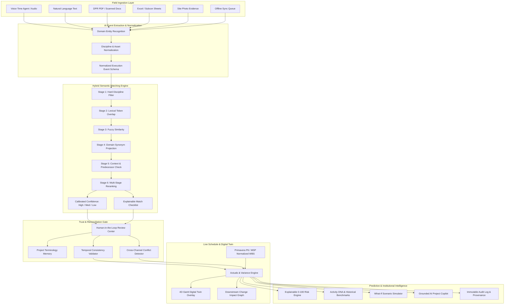
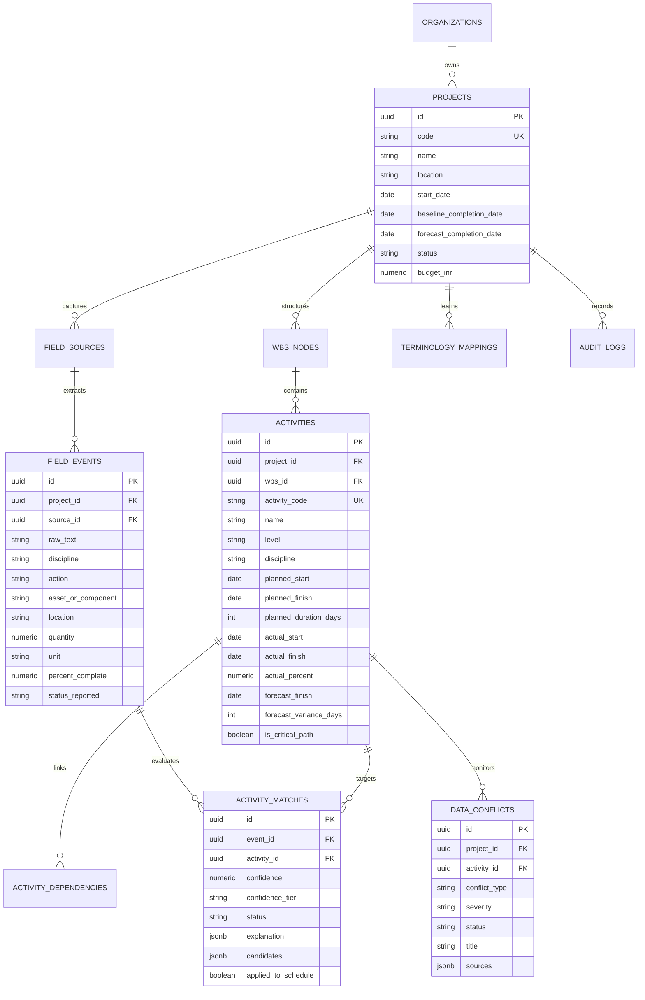

# SiteSync AI — Architectural & Technical Specification
## SIH26122: Intelligent Data Capture & Schedule-Linking Layer for Infrastructure Project Management
**Organization:** Oil India Limited (OIL)  
**Theme:** Smart Automation  
**Core Tagline:** *From field information to trusted project progress — automatically.*

---

## 1. System Overview & Problem Statement Alignment

Large capital infrastructure projects (such as Oil India Limited's refinery expansions, crude oil booster stations, and gas gathering networks) maintain rigorous baseline schedules containing thousands of hierarchical activities (from L1 down to L5/L6 executable activities). 

However, physical progress on site is captured across fragmented, unstructured channels:
- Voice audio dispatches from site supervisors
- Daily Progress Reports (DPRs) in PDF / DOCX
- Subcontractor progress spreadsheets (Excel / CSV)
- Scanned hand-written site diaries
- Site photographs with construction milestones

**SiteSync AI** bridges this critical chasm by acting as an **Intelligent Execution Layer** that transforms unstructured field signals into structured, calibrated, and explainable schedule updates, while enforcing human-in-the-loop oversight, temporal sequence consistency, cross-channel conflict detection, and institutional memory.

---

## 2. High-Level System Architecture

---

## 3. Database Entity-Relationship (ER) Architecture

The relational schema is implemented with PostgreSQL / Supabase, backed by Row Level Security (RLS) and trigram indexing:

---

## 4. Multi-Stage Hybrid Semantic Matching Algorithm

Unlike trivial prototypes that rely solely on cosine similarity over embeddings, SiteSync AI executes an eight-stage calibrated pipeline:

1. **Stage 1 — Hard Structural Filtering:**
   Filters candidate space by discipline (Civil, Piping, Electrical, Rotating Equipment, Instrumentation) and project boundary.
2. **Stage 2 — Lexical Token Overlap:**
   Measures exact technical keyword intersection (pipe, spool, foundation, plinth, cable tray).
3. **Stage 3 — Fuzzy String Similarity:**
   Computes Levenshtein and token-set similarity to tolerate typographical variance and spelling errors common in field logs.
4. **Stage 4 — Project Terminology Memory Boost:**
   Scans the dynamic project vocabulary table. If a colloquially mapped phrase (e.g., *"12 inch spool erected"* → `PIPE-ERECT-L6-0142`) matches, a confidence boost (+0.20 to +0.30) is awarded.
5. **Stage 5 — Contextual & Predecessor Validation:**
   Validates plant location matching (e.g. Area 04 Compressor Bay) and inspects upstream predecessor nodes in the dependency graph.
6. **Stage 6 — Temporal Feasibility Window:**
   Scores whether the reported execution date is within plausible planned and CPM forecast windows.
7. **Stage 7 — Reranking & Calibrated Confidence:**
   $$Score = 0.25 \times Lexical + 0.20 \times Fuzzy + 0.25 \times Discipline + 0.15 \times Context + 0.15 \times Temporal + Boost_{vocab}$$
   - **HIGH ($\ge 90\%$):** Auto-suggest strong match.
   - **MEDIUM ($70\% - 89\%$):** Human review recommended.
   - **LOW ($< 70\%$):** Require planner review before schedule impact.
8. **Stage 8 — Explainable Match Evidence Generator:**
   Produces plain-language checklist items proving *why* the activity was matched (e.g., *✓ 12-inch dimension matches*, *✓ Predecessor F-102 completed*).

---

## 5. Temporal Consistency & Conflict Resolution Engine

To prevent flawed or fraudulent reporting:
- **Chronological Dependency Guardrails:** If Activity B requires Activity A (Finish-to-Start), any field report claiming B is complete while A is incomplete triggers a `TEMPORAL_CONFLICT`.
- **Cross-Channel Contradiction Detection:** When two reporting channels disagree on progress percentage (e.g., Supervisor Voice reports $78\%$ while Subcontractor Spreadsheet claims $70\%$), SiteSync flags a `PROGRESS_CONFLICT`.
- **Zero Silent Overwrite Policy:** Conflicting reports are quarantined in the Conflict Center for planner review, preserving existing verified actuals.

---

## 6. SIH Requirement-to-Feature Traceability Matrix

| SIH26122 Requirement | Implemented Feature in SiteSync AI | Module / Screen | API / Service | Database Entity | 5-Minute Demo Step |
| :--- | :--- | :--- | :--- | :--- | :--- |
| **L5/L6 Schedule Ingestion** | WBS tree explorer + P6/MSP validator | Schedule Explorer | `ScheduleParser` | `activities`, `wbs_nodes` | Step 1 |
| **Voice & Text Ingestion** | Voice Time Agent + waveform visualizer | Field Input Center | `extractExecutionEvent` | `field_events`, `field_sources` | Step 2 |
| **Semantic Activity Link** | Multi-stage hybrid matcher | AI Review Center | `matchExecutionEvent` | `activity_matches`, `activity_candidates` | Step 3 |
| **Confidence & Explanation** | Calibrated score + bulleted checklist | Review Workbench | `generateExplanation` | `activity_matches.explanation` | Step 3 |
| **Human Verification** | 1-click Approval & Schedule Update | Review Center | `approveMatch` | `planner_reviews`, `activities` | Step 4 |
| **Schedule Actuals Update** | Real-time actual start/finish update | 4D Gantt Digital Twin | `applyScheduleActuals` | `activities.actual_percent` | Step 4 |
| **Contradictory Reports** | Progress conflict side-by-side card | Conflict Center | `detectProgressConflict` | `data_conflicts` | Step 5 |
| **Temporal Sequence Check** | Predecessor/successor validator | Conflict Center | `checkTemporalConsistency` | `data_conflicts` | Step 6 |
| **Historical Benchmarking** | 54-project empirical duration median | Activity DNA View | `getHistoricalBenchmark` | `historical_activity_records` | Step 7 |
| **Downstream Impact** | Change Impact Domino Graph | 4D Gantt Overlay | `calculateChangeImpact` | `activity_dependencies` | Step 8 |
| **What-If Scenario Simulator**| Manpower & overtime accelerator | What-If Simulator | `simulateWhatIf` | `whatif_simulations` | Step 9 |
| **Terminology Memory** | Self-learning colloquial dictionary | Review Center | `addTerminologyMapping` | `terminology_mappings` | Step 10 |
| **Full Forensic Provenance** | Immutable audit trail with source doc | Audit Trail View | `AuditLogger` | `audit_logs` | Step 11 |
| **AI Project Copilot** | Grounded project Q&A assistant | Copilot Slide-over | `queryProjectCopilot` | Live DB Projection | On-Demand |

---

## 7. Security & Compliance Architecture

- **Supabase PostgreSQL with Row Level Security (RLS):** Policies isolate project records by role and authenticated tenant.
- **Principle of Least Privilege (RBAC):**
  - *Site Supervisor:* Restricted to field entry, offline queueing, and candidate lookup.
  - *Project Planner:* Full authority to approve AI mappings, resolve conflicts, and modify schedule actuals.
  - *Project Manager:* Read-access to health analytics, What-If simulation, and risk indices.
  - *Admin:* Access to system configuration, audit logs, and terminology retention rules.
- **Zero API Key Leakage:** Client apps only utilize scoped publishable tokens. Service role keys are never bundled in frontend code.
- **Cryptographic Auditability:** Every schedule modification stores `before_value`, `after_value`, `model_version`, and `verified_by`.
